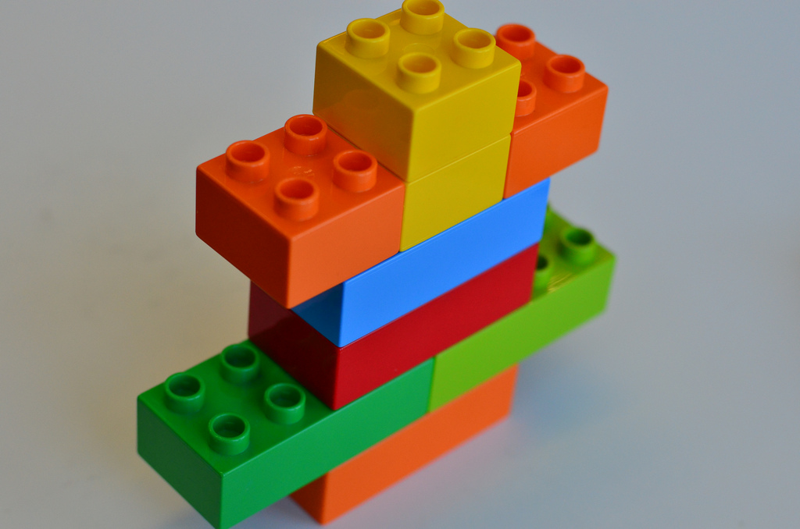

# La frase 

Non è facile definire cosa si intenda con il termine *frase*: in una prima approssimazione possiamo definirla come un'espressione linguistica dotata di significato autonomo. Possiamo distinguere dunque le frasi *semplici* -quelle cioè che non contengono altre frasi- da quelle *complesse* -vale a dire frasi composte da più frasi. 

Le frasi sono costruzioni linguistiche che dipendono da una ben determinata organizzazione sintattica dei contenuti, che non dipende dall'ordine lineare delle parole (la vicinanza degli elementi), bensì dalla struttura soggiacente. Questa proprietà, tipica della sintassi, è definita come **dipendenza dalla struttura**. Così, per es. l'accordo verbale della frase seguente non è scatenato dalla vicinanza dell'elemento, bensì dalle proprietà di quello che, almeno per ora, chiameremo *soggetto*, dove un soggetto plurale (*gli studenti...*) si accorda ad un verbo plurale:

(@)
    a. [Gli studenti bravi del professore] partono domani mattina.  
    a. (*) [Gli studenti bravi del professore] parte domani mattina. 

## La sintassi

Ora ci si potrebbe domandare per quale motivo le seguenti frasi siano l'una perfettamente grammaticale dal punto di vista sintattico ma non dotata di un *senso* concreto mentre l'altra presenta incoerenze sintattiche che non permettono di afferrare il significato:

(@)
    a. (\#) Il gulco gianigeva le brane.  
    a. (*)  Quel guardano luna la bambino.  

Il primo esempio risulta infatti comprensibile, seppure ignoriamo i reali significati delle parole. Quello che afferriamo è infatti che un certo soggetto (un *gulco*), fa una determinata azione (*gianigeva*) su un determinato oggetto (le *brane*). Questa **indipendenza della sintassi** dal significato è una delle proprietà principali: una struttura può risultare *grammaticale* anche quando non vi è una corrispondenza tra la frase e il suo significato.

Abbiamo accennato ad una nozione chiave, quella della **grammaticalità**, che possiamo esplicitare come quella proprietà di un enunciato di esprimere le proprie strutture in maniera coerente dal punto di vista sintattico. Questo ci spiega il motivo per cui il secondo esempio è inaccettabile: la costruzione sintattica esposta viola queste regole: questa è quello che definiamo con l'espressione **dipendenza dalla struttura**. In questa frase, per esempio, tra le tante violazioni troviamo un verbo plurale che non si accorda a nessuno dei due nomi che potrebbero fungere da soggetto (*luna* oppure *bambino*).

Se nel primo esempio, dunque, la sintassi segue tali regole seppure non abbia significati, il secondo, sebbene vi siano dei significati e dei concetti immediatamente comprensibili, non risulta in una costruzione sintatticamente ordinata.

### Le unità sintattiche: i sintagmi

Così come il dominio e le regole della sintassi divergono da quelle della semantica, possiamo chiederci quali siano le unità di questo dominio, ovvero gli elementi attraverso cui si compone. 
Una prima risposta potrebbe essere che queste unità, questi atomi del linguaggio possano effettivamente essere le *parole*. Tuttavia questa distinzione potrebbe portare qualche problema per es. nell'analisi di lingue che non hanno necessariamente un'identica nozione di *parole* (per es. le lingue polisintetiche ecc.).
Inoltre, sembrerebbe che la sintassi agisca ad un livello molto diverso da quelle del linguaggio per come lo interpretiamo in maniera intuitiva e le parole sono indicazioni utili in certi domini di descrizione ma in altri cominciano a risultare un po' oscuri.

In questo ci viene in soccorso la nozione di **sintagma**, coniata dal linguista ginevrino Ferdinand de Saussure dal gr. σύνταγμα^[Per gli scopi di questa dispensa presenterò una definizione che è distante da quella di Saussure.]. 
Possiamo immaginare il sintagma come l'unità sintattica e questa unità come un mattoncino LEGO.


A questo punto la proprietà della sintassi è quella di combinare questi mattoncini: questa proprietà è detta *Merge* (o *Salda* in italiano, ma qui manteniamo la definizione inglese) e permette di prendere due mattoncini (sintagmi) così da formarne un terzo. La sintassi infatti è un'operazione binaria, dove due elementi si combinano per formarne un terzo^[Per uno studio aggiuntivo della materia sintattica si può consultare @chomsky1995; @donati2008; @graffiScalise2009 .]. 



Possiamo dividere queste unità, che chiameremo **costituenti** come sinonimo di sintagma, all'interno di parentesi quadre, così da mostrare i rapporti sintattici:

(@)
    a. I topi non avevano nipoti.  
    a. [ I topi ] [ non avevano [ nipoti ] ].     

oppure mostrare l'organizzazione sintattica attraverso un cosiddetto *diagramma ad albero* come nell'esempio seguente:


```{r tree1, echo=FALSE, engine='tikz', out.width='70%', fig.ext=if (knitr:::is_latex_output()) 'pdf' else 'svg', fig.cap='Rappresentazione ad albero di una frase transitiva', engine.opts = list(template = "latex/tikz2pdf.tex"), fig.align='center'}
\begin{tikzpicture}
\tikzset{every tree node/.style={align=center,anchor=north}}
\Tree 
[ .CP \node(C){C};
[ .TP [.DP\textsubscript{i} \edge[roof]; \node(subj){Un vecchio uomo}; ]  
[  [ .T \node(t0){guarda};  ]
[ .vP [ .DP\textsubscript{i} \node(ti){$t$}; ] 
[ [.DP\textsubscript{j} \edge[roof]; \node(obj){il cantiere}; ]  
[ [ .v  ]
[ .VP [ .V \node(tV){$\sqrt{guard-}$}; ]
[ .DP\textsubscript{j} \node(tj){$t$}; ] ] ] ] ] ] ] ]
\draw[thin,<-] (subj.south) to [bend right=60] (ti.south);
\draw[thin,<-] (obj.south) to [bend right=60] (tj.south);
\end{tikzpicture}
```
Uno studente attento potrebbe notare qualche differenza rispetto ad una notazione ad albero precedente:

```{r tree2, echo=FALSE, engine='tikz', out.width='70%', fig.ext=if (knitr:::is_latex_output()) 'pdf' else 'svg', fig.cap='Rappresentazione secondo lo schema X-barra', engine.opts = list(template = "latex/tikz2pdf.tex"), fig.align='center'}
\begin{tikzpicture}
\tikzset{every tree node/.style={align=center,anchor=north}}
\Tree 
[ .F 
[ .SN \edge[roof]; \node(subj){Un vecchio uomo};]
[. SV [ .V guarda ] [. SN \edge[roof]; \node(obj){il cantiere}; ] ] ]
\end{tikzpicture}
```

La prima e più semplice differenza che possiamo notare è nella denominazione dei costituenti: il primo albero presenta una notazione inglese, mentre il secondo in italiano.  Così *Determiner Phrase* (DP) corrisponde grosso modo a SN, mentre il sintagma verbale (SV) si compone di diversi livelli (VP, vP, TP), che corrispondono all'unione della radice verbale V, al sintagma v (che possiamo dire legato alla transitività -ma v è un po' problematico) ed a quello di tempo finito T. C invece è il costituente iniziale, che nelle frasi semplici italiane non è pronunciato (ma vedremo oltre che è presente in altri contesti).
Così, la derivazione procede sulla linea dei costituenti C-T-v-V.

### Le proprietà della sintassi

Le differenze tra questi due sistemi di visualizzazioni derivano però da un'importante rivisitazione teorica all'interno della teoria sintattica.

Le proprietà principali della sintassi sono la **ricorsività** e la **gerarchia**.
Con il termine *ricorsivo* definiamo quella capacità linguistica di poter aggiungere sempre ulteriore materiale linguistico ad una frase, seguendo certe regole: in pratica possiamo immaginare di poter aggiungere sempre un mattoncino Lego alla costruzione ottenuta dall'unione dei mattoncini.
Definiamo questa proprietà della sintassi come *generativa*, e risulta in un indefinito (virtualmente infinito) meccanismo di formazione di nuove strutture^[La sintassi permette di agire in via infinita, ma altre limitazioni fisiche (per es. la memoria) impediscono di sperimentare tale uso infinito]. Possiamo dire che questo generare continuamente nuovo materiale sia il motore dell'aspetto *creativo* del linguaggio.  
Questa capacità ricorsiva della sintassi prevede però un'ulteriore effetto: le strutture sintattiche presentano uguali meccanismi di formazione per cui una frase complessa ha la stessa geometria di un singolo costituente. Il minimo e il complesso, in questa descrizione linguistica, condividono le proprietà basilari di formazione.


Con *gerarchia* invece ci riferiamo a quella proprietà della sintassi, che opera su un piano diverso da quello con cui siamo soliti interagire nella lingua. La nostra esperienza linguistica quotidiana infatti è mono-dimensionale, legata all'ordine delle parole nella frase in un senso lineare. Ma il modo in cui costruiamo le frasi non è legato ad uno spazio ad una dimensione, bensì risiede in uno contraddistinto da più dimensioni, con differenti nozioni di località. Così, per esempio, le lingue non sono legate ad una organizzazione sintattica sulla base dell'ordine delle parole (per es. il soggetto non è "la parola immediatamente vicina al verbo") bensì al loro ruolo nella struttura sintattica.

#### La geometria della sintassi

### I test di costituenza

## Coordinazione

## Giustapposizione

## Connettori 

## Esempi


