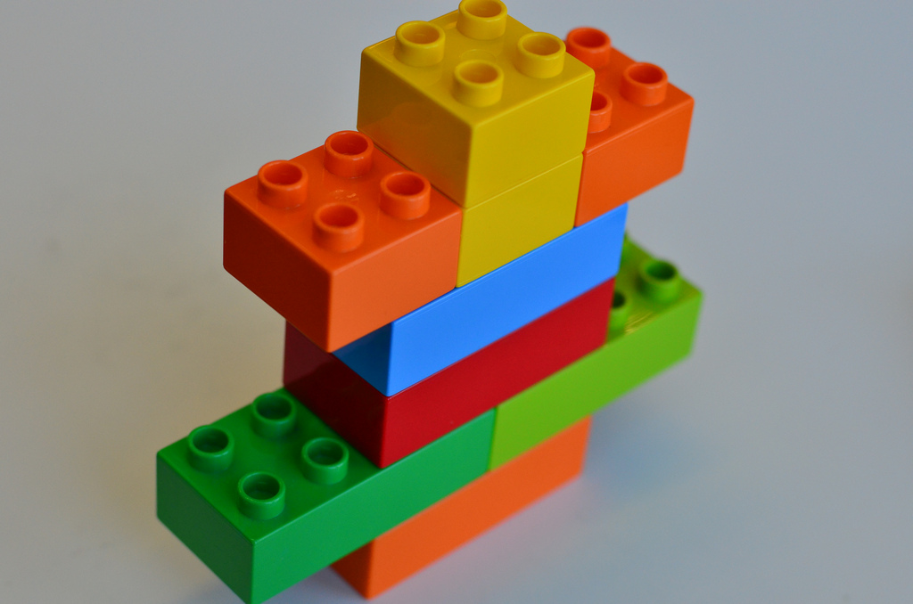

--- 
title: "Sintassi Italiana 2"
subtitle: "Dispense per gli studenti del corso KRI/SYNT2"
author: "Marco Petolicchio"
date: "`r Sys.Date()`"
site: bookdown::bookdown_site
output: bookdown::gitbook
documentclass: scrbook
lot: yes
lof: yes
classoption: [a4paper,twoside,11pt,chapterprefix=false, bibliography=totocnumbered,listof=flat]
bibliography: [bibliography.bib]
biblio-style: apa
link-citations: yes
github-repo: p-marco.github.io/sintassiIta2
description: "sintassiIta2"
always_allow_html: yes
---


# Introduzione {-}

> Se il mondo ha la struttura del linguaggio  
> e il linguaggio ha la forma della mente  
> la mente con i suoi pieni e i suoi vuoti  
> è niente o quasi e non ci rassicura.  
>
> E. Montale, *La forma del mondo*, in "Diario del '71"
  

Questa dispensa nasce come materiale di studio per l'esame di Sintassi Italiana 2 per gli studenti triennali dell'Università Palacky di Olomouc, pensata in maniera specifica per studenti non madrelingua. Si fa riferimento a nozioni *tradizionali* della linguistica e degli studi sintattici rimandando, laddove si è ritenuto più pertinente, a degli studi più recenti in maniera da poter stimolare ulteriormente lo studente.  

Le abbreviazioni morfologiche e lo stile delle glosse interlineari aderiscono rispettivamente agli standard *de facto* delle annotazioni di linguistica comparativa [@boeckxListOfAbbreviations, [consultabile online](http://www.oxfordhandbooks.com/view/10.1093/oxfordhb/9780199549368.001.0001/oxfordhb-9780199549368)] e dello stile delle glosse *di Lipsia* [@leipzigGlossingRules].

Nel testo si segue l'uso standard di definire i vari gradi di accettabilità di una frase attraverso le seguenti marche tipografiche:

* ( ) Grammaticale
* (*) Agrammaticale
* (?) Dubbia grammaticalità
* (\#) Grammaticale dal punto di vista sintattico ma interpretazione semantica non coerente

Per qualsiasi informazione o suggerimento è possibile scrivere direttamente all'autore all'indirizzo `marco.petolicchio01@upol.cz` oppure aprire un issue direttamente sulla pagina del repository su [Github](http://github.com/p-marco/sintassiIta2).

Quest'opera è rilasciata con licenza Creative Commons BY 4.0. Il codice sorgente è disponibile all'indirizzo `http://github.com/p-marco/sintassiIta2` e le versioni del progetto sono rilasciate in DOI attraverso la piattaforma Zenodo (DOI:10.5281/zenodo.2355707).


<!--chapter:end:index.Rmd-->

\mainmatter


<!--chapter:end:005-mainmatter.Rmd-->

\part*{Parte I. \\\ Questioni preliminari}

<!--chapter:end:010-part1.Rmd-->


# Le parti del discorso

Le parole di una lingua vengono divise all'interno di categorie grammaticali. In italiano --una lingua flessiva come buona parte delle lingue indoeuropee [@graffiScalise2009]-- queste suddivisioni avvengono per criteri di natura sintattica, ovvero la posizione ed il ruolo delle parole all'interno della frase. Tradizionalmente possiamo riconoscere 9 diverse **parti del discorso** [@salvi2013], tra cui possiamo operare una ulteriore suddivisione: quelle (parti) *variabili* e quelle *invariabili*.  


## Le parti variabili

In italiano si definiscono parti **variabili** del discorso quelle che hanno la possibilità di modificarsi sulla base di alcuni *tratti* o *categorie grammaticali* [@simone1995 Cap.9] come il Genere, il Numero, la Persona, il Caso, il Tempo, l'Aspetto, il Modo ecc.. 

### Aggettivo  

L'aggettivo è un *modificatore* di altri elementi del discorso, soprattutto del sostantivo, con cui instaura un rapporto sintattico che si manifesta, nella maggior parte dei casi, nella concordanza grammaticale (*Brutto stamani il tempo e ancora più pestifero il Tempo* [@montale-satura], *Le lasagne scaldate nel micro che da solo mi sento cattivo* [@fibra2017]).


Tradizionalmente possiamo suddividere la classe di aggettivi in due categorie:

* Determinativi:
    * Possessivi (*mia, vostre, suo*)
    * Numerali:
        * Cardinali (*due, trentatré*) 
        * Ordinali (*primo, quarantatreesimo*)
    * Dimostrativi (*questo, quello*)
    * Indefiniti (*alcuni, tutti, nessuna*)
    * Interrogativi ed esclamativi (*quale?, quanti?, quale gioia!, ma che onore!*)
* Qualificativi (*forte, grande, bello, rettangolare, goloso, verde, vecchio*)

I determinativi esprimono alcune funzioni della referenza (per esempio il possesso), mentre i qualificativi esprimono dei caratteri quali il colore, la forma, l'aspetto, le qualità. Quella dei determinativi è una classe *chiusa*, mentre quella dei qualificativi è una classe *aperta* che prevede cioè la possibilità di espandersi in maniera indefinita.

### Articolo

L'articolo è quella particella che si accompagna al nome o ad altre parti del discorso in funzione sostantivata. In italiano esso concorda nei tratti di Numero, Persona, Genere con il sostantivo di riferimento [@grandi2010].
Le lingue del mondo non presentano tutte lo stesso comportamento nei riguardi della posizione e/o della presenza dell'articolo e possiamo trovare:

* Lingue senza articoli (*ceco, slovacco*)
* Lingue con articoli
    * Proclitici (*italiano, inglese*)
    * Enclitici (*bulgaro, macedone*)

In una lingua come l'italiano, la presenza dell'articolo è lo *standard*, ovvero non ha una funzione specifica mentre la sua assenza assume significato. Così, per esempio, in **italiano standard**^[Alcune varietà di italiano, quali i dialetti settentrionali, hanno invece gli articoli in questi contesti [@loporcaro2009].] i nomi propri escludono l'articolo (*Marta va in città* vs. *\*La Marta va in città*) così come è esclusa la possibilità di trovare l'articolo in combinazione con il possessivo nei nomi di famiglia (*mio figlio si chiama Luigi* vs. *\* Il mio figlio si chiama Luigi*). 

\begin{table}[]
\begin{tabular}{@{}lrrrrrr@{}}
\toprule
      & \multicolumn{2}{c}{Definito} & \multicolumn{2}{c}{Indefinito} & \multicolumn{2}{c}{Partitivo} \\ \midrule
      & Sing          & Plur         & Sing           & Plur          & Sing          & Plur          \\
Masch & il            & i            & un             & -             & del           & dei           \\
Masch & lo            & gli          & uno            & -             & dello         & degli         \\
Fem   & la            & le           & una            & -             & della         & delle         \\ \bottomrule
\end{tabular}
\caption{Tabella riassuntiva degli articoli in italiano}
\end{table}


#### Definito

L'articolo definito o *determinativo* può indicare un referente determinato, ovvero noto (*Sto cercando il libro*, *hai visto la mia maglietta?*).


#### Indefinito

Quello indefinito o indeterminativo può essere usato per indicare un sostantivo indefinito specifico (*non trovo un libro che avevo lasciato a casa*) oppure non specifico (*per la nuova casa vorrei trovare un inquilino simpatico*). Gli articoli indefiniti non possono essere usati al plurale e la loro forma è la stessa del numero "uno" (1). 


#### Partitivo

L'articolo partitivo si usa per indicare quantità indefinite o parti di un insieme (*vorrei del pane*, *sto cercando dei libri*, *la maggior parte dei ragazzi pensa solo a una cosa*). Si forma dall'unione delle forme "di" con l'articolo definito (*del*, *dello*, *della*, *dei*, *degli*, *delle*).

### Nome

Il nome o *sostantivo* è la parte del discorso che designa entità, persone, oggetti, idee, fatti ecc. 
Il nome è una parte variabile, che modifica la sua flessione (*morfologia flessionale*) in conseguenza di alcuni tratti della parola quale il Numero, il Genere e che può modificarsi tramite l'aggiunta di morfemi che ne codificano un significato diminutivo, vezzeggiativo ecc. (*morfologia derivazionale*).

Dal punto di vista formale possiamo dividere il nome in base ad alcune categorie grammaticali:

* Genere
    * Maschile 
    * Femminile 
    * Genere comune
    * Genere misto (*osso/ossa, uovo/uova*)

* Numero
    * Singolare
    * Plurale 
    * Collettivo (*gregge, biblioteca*)


In italiano la marca di numero e di genere è resa in un unico suffisso *portmanteu* (cioè che testimonia diversi valori insieme), mentre in lingue agglutinanti di solito questi tratti possono essere realizzati da differenti morfemi. 


### Pronome

Il pronome è quella categoria grammaticale *coreferenziale* del nome a cui si riferisce e sostituisce: presenta cioè lo stesso riferimento --quale può essere la persona-- (*referenza*) del sostantivo (*Ho visto Gianni. Sì, lui*(=Gianni) *sta molto bene*; *La sigaretta, Luigi la*(=sigaretta) *fuma dopo il caffè*).

I pronomi sono **personali** (*io, tu, noi*), **possessivi** (*mio, tua*), **dimostrativi** (*questo, quello*), **riflessivi** (*io mi pettino, voi vi amate?*), **relativi** (*che, la quale*), **interrogativi** (*non so chi tu sia*), **numerali**.

La differenza tra pronome e aggettivo in alcuni casi è esclusivamente riferibile al contesto sintattico, come dimostra l'esempio seguente:


(@)
    \gll    La              mia             penna       è           blu,    la      tua             è       nera.  
            ART.DEF.F.sg    ADJ.POSS.F.1sg  NOUN.F.sg   COPULA.3sg  ADJ.    ART.    PRON.POSS.F.2sg COPULA.3sg  ADJ.  
    \glt    ''


L'italiano è una lingua a soggetto nullo, che permette cioè la possibilità di omettere il pronome personale in alcune costruzioni (*(Io) mangio il pane con la marmellata*).


### Verbo

Il verbo è la parte del discorso che codifica gli stati, gli eventi, le azioni ecc. 
Possiamo distinguere in esso alcuni caratteri formali quali la classe di coniugazione (*-are, -ere, -ire*), i tratti (aspetto, modo ecc.), il numero di argomenti (verbi transitivi, intransitivi ecc.).

#### Categorie del verbo

Sono categorie del verbo il Tempo, l'Aspetto e il Modo (TAM).

L'italiano è una lingua 


#### Argomenti del verbo

Negli studi moderni la transitività è trattata piuttosto come un *continuum* con degli estremi che corrispondono grosso modo al numero di argomenti del verbo. 
Possiamo distinguere i verbi sulla base del numero di argomenti di cui necessitano:

* Intransitivi
    * Inergativi
    * Inaccusativi
* Transitivi
* Ditransitivi
 

##### Intransitivi

I verbi intransitivi o mono-argomentali presentano un solo argomento (*Lui cammina*, *Lei corre*) e sono divisi in due sotto-categorie. Nei verbi **inergativi** (dal greco ant.  ἔργον *érgon*, "lavoro")  il soggetto ha le proprietà sintattiche tipiche di un soggetto transitivo, mentre in quelli **inaccusativi** il soggetto si comporta più come un oggetto delle costruzioni transitive. Sono esempio della prima sottocategoria verbi quali *correre, lavorare, ridere*, mentre della seconda *scoppiare, sparire, cadere*. Un modo per distinguere tali classi di verbi gli uni dagli altri è verificare l'ausiliare nei tempi composti: quelli inergativi presentano il verbo *avere* (*ieri ho lavorato molto*), gli inaccusativi hanno *essere* (*dov'eri? sei sparito subito!*) e l'accordo del participio passato nei tratti del Numero, possibile con gli inaccusativi e non con gli inergativi: *avete lavorato duramente* vs. *siete spariti subito!*. L'argomento dei verbi intransitivi è il soggetto (S).

##### Transitivi

I verbi transitivi collegano prototipicamente due argomenti: il soggetto transitivo (A) e l'oggetto diretto (O) (*Mario mangia la mela*, *Gli attori recitano una commedia*). 

Le costruzioni transitive possono essere regolarmente trasformate in corrispondenti frasi *passive*: in questo caso l'oggetto viene posto in posizione di soggetto e il soggetto transitivo in agente:

(@)
    \gll    Mario   mangia  la mela.  
            A       VP      O  
    \glt  


(@)
    \gll    La mela     è mangiata  da Mario.  
            S           VP          Ag  
    \glt  

Così, spesso, le costruzioni transitive possono essere trasformate in corrispondenti intransitive (con una certa modifica nel carico semantico dell'enunciato):

(@)
    \gll    Mario   mangia.  
            S       VP        
    \glt  


##### Ditransitivi e oltre

I verbi di-transitivi reggono 3 argomenti: A,O e Oggetto Indiretto (IO), e possono essere passivizzati:

(@)
    \gll    Mario   regala  una rosa    a Luigi.  
            A       VP      O           IO        
    \glt  


(@)
    \gll    Una rosa    è regalata  a Luigi da Mario.  
            S           VP          IO      IO        
    \glt  

Per esemplificare un verbo tetravalente, ovvero che regge 4 argomenti, possiamo riferirci a *tradurre*:

(@)
    \gll    San Girolamo    tradusse    alcuni libri della Bibbia   dal greco   al latino.  
            A               VP          O                           IO          IO        
    \glt 


## Le parti invariabili

Sono parti invariabili del discorso quelle che si presentano sempre nella stessa forma, senza cambiamenti morfologici.

### Avverbio

L'avverbio è un modificatore di altri elementi della frase come: aggettivi (*Gli spaghetti sono molto buoni*), verbi (*Sappiamo cucinare bene gli spaghetti*), ed altri avverbi (*Arriveremo molto presto*).
Un'espressione formata da diverse parole con funzione di avverbio è detta *locuzione avverbiale*.

Gli avverbi possono essere di **modo**--indicano cioè il modo dell'azione (*velocemente, bene*)--, di **tempo** (*ora, mai, sempre*), di **luogo** (*qui, lì, giù*), di **quantità** (*poco, molto*), **di opinione** (*sì, no, esatto, chissà, magari*), **interrogativi ed esclamativi** (*come, perché, dove, quando*), **presentativi** (*inoltre, ecco*).

Gli avverbi hanno gli stessi *gradi* dell'aggettivo e in certi casi possono essere alterati da suffissi:

* Gradi
    * Positivo (*velocemente*)
    * Comparativo
        * Di maggioranza (*più velocemente*)
        * Di minoranza (*meno velocemente*)
        * Di uguaglianza (*tanto velocemente quanto*)
    * Superlativo
        * Relativo (*il più velocemente (possibile)*)
        * Assoluto (*velocissimamente*)

* Alterazioni
    * Diminutivo 
    * Vezzeggiativo
    * Accrescitivo
    * Dispregiativo

### Congiunzione

La congiunzione è la parte del discorso che permette l'unione di sintagmi o frasi. Possono essere **positive** (*e, anche, pure*), **negative** (*né, neanche, nemmeno*), **disgiuntive** (*o, oppure, altrimenti*), **avversative** (*anzi, ma, tuttavia, nonostante*), **conclusive** (*dunque, allorché*).


### Interiezione

L'interiezione esprime un particolare atteggiamento del parlante. Sono esempi di interiezioni **proprie** particelle quali *ah!, eh!, oh!*, **improprie** se comprendono altre parti del discorso (*zitto!, cavolo!*) e **locuzioni interiettive** se formate da più parole (*per Dio!, per amor del cielo, porca miseria*).
Particolarmente usata nella comunicazione orale, presenta una grande varianza all'interno dei sistemi dialettali, dando luogo a espressioni particolarmente colorite(*figa, pota, cazzo, stocazzo, sticazzi, minchia, mecojoni*).

### Preposizione

Le preposizioni sono poste *prima* del nome o di altri elementi (*Sono andato a Praga la settimana scorsa; Non ho mai lavorato in Germania; Vieni prima di subito*). 

Sono preposizioni **proprie** *di, a, da, in, con, su, per, tra,fra*, **improprie** *dopo, tranne, salvo, verso, contro, circa*, **locuzioni prepositive** *a causa di, per mezzo di, in base a*.


## I tratti


A questo punto possiamo trasporre alcune di queste definizioni grammaticali all'interno di una prospettiva sintattica. La prima domanda a cui possiamo tentare di dare una risposta è: *cos'è una parola? E in che modo le parole si organizzano in una grammatica?*
Abbiamo visto infatti che le parti del discorso sono delle categorie di parole unite tra loro dal fatto che possiamo sostituire una parola da una della stessa categoria (*Il libro è sul tavolo* / *Un libro è sul tavolo*), senza cambiarne lo statuto sintattico.

Rimane dunque la definizione di *parola*. Possiamo, dal punto di vista sintattico definire le parole come elementi linguistici che presentano dei *tratti*. Ad es. nel caso dei nomi, i tratti possono essere il Genere, il Numero, il Caso. Questa definizione, che non presenta complessità di natura teoretica, trova spazio in un'analisi esclusivamente sintattica e ci permette di pensare alle parole come a degli oggetti dotati di certe proprietà (i tratti). In italiano possiamo distinguere varie categorie sulla base dei tratti che presentano:

| Categoria          | Tratti                                |
|--------------------|---------------------------------------|
| Nome (N)           | Numero, Genere, Caso                  |
| Aggettivo (A)      | Numero, Genere                        |
| Determinante (D)   | Numero, Genere, Caso                  |
| (Pronome)          | Numero, Genere, Caso, Persona         |
| Quantificatore (Q) | Numero, Genere                        |
| Verbo (V)          | Numero, Persona, Tempo, Modo, Aspetto |


Così, le parole sono le unità concrete della lingua, e la sintassi è quella componente che assembla le varie parti del discorso sulla base di entità più *piccole* della parola, i *tratti*.

<!--chapter:end:011-partiDelDiscorso.Rmd-->


# La frase 

Non è facile definire cosa si intenda con il termine *frase*: in una prima approssimazione possiamo definirla come un'espressione linguistica dotata di significato autonomo. Possiamo distinguere dunque le frasi *semplici* -quelle cioè che non contengono altre frasi- da quelle *complesse* -vale a dire frasi composte da più frasi. 

Le frasi sono costruzioni linguistiche che dipendono da una ben determinata organizzazione sintattica dei contenuti, che non dipende dall'ordine lineare delle parole (la vicinanza degli elementi), bensì dalla struttura soggiacente. Questa proprietà, tipica della sintassi, è definita come **dipendenza dalla struttura**. Così, per es. l'accordo verbale della frase seguente non è scatenato dalla vicinanza dell'elemento, bensì dalle proprietà di quello che, almeno per ora, chiameremo *soggetto*, dove un soggetto plurale (*gli studenti...*) si accorda ad un verbo plurale:

(@)
    a. [Gli studenti bravi del professore] partono domani mattina.  
    a. (*) [Gli studenti bravi del professore] parte domani mattina. 

## La sintassi

Ora ci si potrebbe domandare per quale motivo le seguenti frasi siano l'una perfettamente grammaticale dal punto di vista sintattico ma non dotata di un *senso* concreto mentre l'altra presenta incoerenze sintattiche che non permettono di afferrare il significato:

(@)
    a. (\#) Il gulco gianigeva le brane.  
    a. (*)  Quel guardano luna la bambino.  

Il primo esempio risulta infatti comprensibile, seppure ignoriamo i reali significati delle parole. Quello che afferriamo è infatti che un certo soggetto (un *gulco*), fa una determinata azione (*gianigeva*) su un determinato oggetto (le *brane*). Questa **indipendenza della sintassi** dal significato è una delle proprietà principali: una struttura può risultare *grammaticale* anche quando non vi è una corrispondenza tra la frase e il suo significato.

Abbiamo accennato ad una nozione chiave, quella della **grammaticalità**, che possiamo esplicitare come quella proprietà di un enunciato di esprimere le proprie strutture in maniera coerente dal punto di vista sintattico. Questo ci spiega il motivo per cui il secondo esempio è inaccettabile: la costruzione sintattica esposta viola queste regole: questa è quello che definiamo con l'espressione **dipendenza dalla struttura**. In questa frase, per esempio, tra le tante violazioni troviamo un verbo plurale che non si accorda a nessuno dei due nomi che potrebbero fungere da soggetto (*luna* oppure *bambino*).

Se nel primo esempio, dunque, la sintassi segue tali regole seppure non abbia significati, il secondo, sebbene vi siano dei significati e dei concetti immediatamente comprensibili, non risulta in una costruzione sintatticamente ordinata.

### Le unità sintattiche: i sintagmi

Così come il dominio e le regole della sintassi divergono da quelle della semantica, possiamo chiederci quali siano le unità di questo dominio, ovvero gli elementi attraverso cui si compone. 
Una prima risposta potrebbe essere che queste unità, questi atomi del linguaggio possano effettivamente essere le *parole*. Tuttavia questa distinzione potrebbe portare qualche problema per es. nell'analisi di lingue che non hanno necessariamente un'identica nozione di *parole* (per es. le lingue polisintetiche ecc.).
Inoltre, sembrerebbe che la sintassi agisca ad un livello molto diverso da quelle del linguaggio per come lo interpretiamo in maniera intuitiva e le parole sono indicazioni utili in certi domini di descrizione ma in altri cominciano a risultare un po' oscuri.

In questo ci viene in soccorso la nozione di **sintagma**, coniata dal linguista ginevrino Ferdinand de Saussure dal gr. σύνταγμα^[Per gli scopi di questa dispensa presenterò una definizione che è distante da quella di Saussure.]. 
Possiamo immaginare il sintagma come l'unità sintattica e questa unità come un mattoncino LEGO.


A questo punto la proprietà della sintassi è quella di combinare questi mattoncini: questa proprietà è detta *Merge* (o *Salda* in italiano, ma qui manteniamo la definizione inglese) e permette di prendere due mattoncini (sintagmi) così da formarne un terzo. La sintassi infatti è un'operazione binaria, dove due elementi si combinano per formarne un terzo^[Per uno studio aggiuntivo della materia sintattica si può consultare @chomsky1995; @donati2008; @graffiScalise2009 .]. 



Possiamo dividere queste unità, che chiameremo **costituenti** come sinonimo di sintagma, all'interno di parentesi quadre, così da mostrare i rapporti sintattici:

(@)
    a. I topi non avevano nipoti.  
    a. [ I topi ] [ non avevano [ nipoti ] ].     

oppure mostrare l'organizzazione sintattica attraverso un cosiddetto *diagramma ad albero* come nell'esempio seguente:


```{r tree1, echo=FALSE, engine='tikz', out.width='70%', fig.ext=if (knitr:::is_latex_output()) 'pdf' else 'svg', fig.cap='Rappresentazione ad albero di una frase transitiva', engine.opts = list(template = "latex/tikz2pdf.tex"), fig.align='center'}
\begin{tikzpicture}
\tikzset{every tree node/.style={align=center,anchor=north}}
\Tree 
[ .CP \node(C){C};
[ .TP [.DP\textsubscript{i} \edge[roof]; \node(subj){Un vecchio uomo}; ]  
[  [ .T \node(t0){guarda};  ]
[ .vP [ .DP\textsubscript{i} \node(ti){$t$}; ] 
[ [.DP\textsubscript{j} \edge[roof]; \node(obj){il cantiere}; ]  
[ [ .v  ]
[ .VP [ .V \node(tV){$\sqrt{guard-}$}; ]
[ .DP\textsubscript{j} \node(tj){$t$}; ] ] ] ] ] ] ] ]
\draw[thin,<-] (subj.south) to [bend right=60] (ti.south);
\draw[thin,<-] (obj.south) to [bend right=60] (tj.south);
\end{tikzpicture}
```
Uno studente attento potrebbe notare qualche differenza rispetto ad una notazione ad albero precedente:

```{r tree2, echo=FALSE, engine='tikz', out.width='70%', fig.ext=if (knitr:::is_latex_output()) 'pdf' else 'svg', fig.cap='Rappresentazione secondo lo schema X-barra', engine.opts = list(template = "latex/tikz2pdf.tex"), fig.align='center'}
\begin{tikzpicture}
\tikzset{every tree node/.style={align=center,anchor=north}}
\Tree 
[ .F 
[ .SN \edge[roof]; \node(subj){Un vecchio uomo};]
[. SV [ .V guarda ] [. SN \edge[roof]; \node(obj){il cantiere}; ] ] ]
\end{tikzpicture}
```

La prima e più semplice differenza che possiamo notare è nella denominazione dei costituenti: il primo albero presenta una notazione inglese, mentre il secondo in italiano.  Così *Determiner Phrase* (DP) corrisponde grosso modo a SN, mentre il sintagma verbale (SV) si compone di diversi livelli (VP, vP, TP), che corrispondono all'unione della radice verbale V, al sintagma v (che possiamo dire legato alla transitività -ma v è un po' problematico) ed a quello di tempo finito T. C invece è il costituente iniziale, che nelle frasi semplici italiane non è pronunciato (ma vedremo oltre che è presente in altri contesti).
Così, la derivazione procede sulla linea dei costituenti C-T-v-V.

### Le proprietà della sintassi

Le differenze tra questi due sistemi di visualizzazioni derivano però da un'importante rivisitazione teorica all'interno della teoria sintattica.

Le proprietà principali della sintassi sono la **ricorsività** e la **gerarchia**.
Con il termine *ricorsivo* definiamo quella capacità linguistica di poter aggiungere sempre ulteriore materiale linguistico ad una frase, seguendo certe regole: in pratica possiamo immaginare di poter aggiungere sempre un mattoncino Lego alla costruzione ottenuta dall'unione dei mattoncini.
Definiamo questa proprietà della sintassi come *generativa*, e risulta in un indefinito (virtualmente infinito) meccanismo di formazione di nuove strutture^[La sintassi permette di agire in via infinita, ma altre limitazioni fisiche (per es. la memoria) impediscono di sperimentare tale uso infinito]. Possiamo dire che questo generare continuamente nuovo materiale sia il motore dell'aspetto *creativo* del linguaggio.  
Questa capacità ricorsiva della sintassi prevede però un'ulteriore effetto: le strutture sintattiche presentano uguali meccanismi di formazione per cui una frase complessa ha la stessa geometria di un singolo costituente. Il minimo e il complesso, in questa descrizione linguistica, condividono le proprietà basilari di formazione.


Con *gerarchia* invece ci riferiamo a quella proprietà della sintassi, che opera su un piano diverso da quello con cui siamo soliti interagire nella lingua. La nostra esperienza linguistica quotidiana infatti è mono-dimensionale, legata all'ordine delle parole nella frase in un senso lineare. Ma il modo in cui costruiamo le frasi non è legato ad uno spazio ad una dimensione, bensì risiede in uno contraddistinto da più dimensioni, con differenti nozioni di località. Così, per esempio, le lingue non sono legate ad una organizzazione sintattica sulla base dell'ordine delle parole (per es. il soggetto non è "la parola immediatamente vicina al verbo") bensì al loro ruolo nella struttura sintattica.

#### La geometria della sintassi

Abbiamo definito questi piccoli mattoncini della sintassi come *costituenti* e abbiamo fatto riferimento ad una certa nozione di *spazio sintattico*. La domanda che potrebbe sorgere sarebbe a questo punto su come sia costituita la *geometria* della sintassi.

Un costituente è un elemento sintattico costituito primariamente dalla sua *testa*, che ne caratterizza il *tipo*. Abbiamo detto inoltre che i costituenti si aggiungono sempre per via binaria, dal basso verso l'alto dell'albero di derivazione: il costituente a cui il costituente in esame si unisce via merge è detto *complementatore*.
Esistono poi altre due posizioni, dette *specificatori* ed *aggiunti*, che insieme formano l'*angolo* del costituente. 

```{r tree3, echo=FALSE, engine='tikz', out.width='70%', fig.ext=if (knitr:::is_latex_output()) 'pdf' else 'svg', fig.cap='Raffigurazione di un costituente', engine.opts = list(template = "latex/tikz2pdf.tex"), fig.align='center'}
\begin{tikzpicture}
\tikzset{every tree node/.style={align=center,anchor=north}}
\Tree 
[ .Costituente
[ .Specificatore ]  
[  [ .Testa  ]
[ .Complemento ]
]
]
\end{tikzpicture}
```

Possono essere presenti più specificatori ed ogni specificatore è *equidistante* dalla testa rispetto ad un altro specificatore dello stesso costituente:

```{r tree4, echo=FALSE, engine='tikz', out.width='70%', fig.ext=if (knitr:::is_latex_output()) 'pdf' else 'svg', fig.cap='Un costituente XP', engine.opts = list(template = "latex/tikz2pdf.tex"), fig.align='center'}
\begin{tikzpicture}
\tikzset{every tree node/.style={align=center,anchor=north}}
\Tree 
[ .XP [ .YP Y ]
[   
[ .ZP Z ]  
[  [ .X  ]
[ .WP ]
]
]
]
\end{tikzpicture}
```

Così, tradizionalmente, alcuni costituenti ospitano 0,1 o più specificatori, che a loro volta possono avere una struttura ramificata: solitamente, in una costruzione finita transitiva in italiano, VP ne ha zero e vP ne ha due.
Ogni costituente presenta 1 testa ed ha uno ed un solo costituente in posizione di complementatore.
Possiamo infatti dire che la testa fornisce l'etichetta del costituente corrispondente (*endocentricità*) e che ogni costituente viene unito ad un altro (l'operazione Merge è binaria), così da avere un solo complementatore.


```{r tree5, echo=FALSE, engine='tikz', out.width='90%', fig.ext=if (knitr:::is_latex_output()) 'pdf' else 'svg', fig.cap='Una semplice derivazione sintattica', engine.opts = list(template = "latex/tikz2pdf.tex"), fig.align='center'}

\begin{minipage}[b]{.22\linewidth}
\begin{tikzpicture}
\tikzset{every tree node/.style={align=center,anchor=north}}
\Tree
[ .{} X [ ... ] ]
\end{tikzpicture}
\end{minipage}%
\begin{minipage}[b]{.22\linewidth}
\begin{tikzpicture}
\tikzset{every tree node/.style={align=center,anchor=north}}
\Tree
[ .XP X [ ... ] ]
\end{tikzpicture}
\end{minipage}%
\begin{minipage}[b]{.22\linewidth}
\begin{tikzpicture}
\tikzset{every tree node/.style={align=center,anchor=north}}
\Tree
[ .{} Y [ .XP X ] ]
\end{tikzpicture}
\end{minipage}%
\begin{minipage}[b]{.22\linewidth}
\begin{tikzpicture}
\tikzset{every tree node/.style={align=center,anchor=north}}
\Tree
[ .YP Y [ .XP X ] ]
\end{tikzpicture}
\end{minipage}%

```


Così le nozioni di *precedenza* e *ordine* risiedono nella struttura sintattica di derivazione, creando una metrica e uno spazio che presenta i propri meccanismi di formazione. Sarà utile infatti tenere a mente che quando parleremo di queste proprietà ci riferiremo primariamente, se non esclusivamente, a tale spazio sintattico.

### I test di costituenza

Possiamo definire quali sono i sintagmi di una costruzione linguistica basandoci su alcuni test, che permettono di risolvere qualche incertezza. Prendiamo come esempio la frase:

(@)
    Luigi insegna Geologia a Bratislava

Le operazioni che possiamo compiere per catturare i sintagmi della frase sono, per esempio:

*   **Coordinazione**  
    * Luigi insegna Geologia e Fisica dei Materiali a Bratislava
    * (*) Luigi insegna Geologia e veloce a Bratislava
*   **Ellissi**  
    * Luigi insegna a Bratislava e anche Maria *(insegna a Bratislava)*
*   **Isolamento**  
    * A Bratislava *(Dove insegna Luigi?)*
    * Geologia *(Cosa insegna Luigi?)*
*   **Non interruzione**  
    * (*) a insegna Bratislava Luigi Geologia
*   **Sostituzione** con proforme (p.es. pronome)  
    * Lui insegna Geologia
    * Lui la insegna lì
*   **Spostamento**  
    * A Bratislava Luigi insegna Geologia

Così, per riprendere la definizione precedente, possiamo pensare alla nozione di *sintagma* come a quella unità sintattica che si compone solitamente di una o più parole, mentre ai *costituenti* come unità che possono anche essere più piccole, arrivando ben al di sotto del livello della parola.  


## La frase semplice

Con *frase semplice* intendiamo una costruzione linguistica che non presenta più di un predicato verbale e i suoi argomenti.


### Il nucleo sintattico

Possiamo pensare alla frase come a una costruzione che presenti un *nucleo* ed un *intorno*.
Così il nucleo è la parte necessaria della costruzione linguistica, costituita da quelli che sono gli argomenti del verbo, mentre il suo margine è formato dagli elementi *circostanziali*, quelli cioè che possono essere omessi senza che la costruzione linguistica presenti perdite strutturali:

(@)
    a.  Gli studenti hanno visitato Praga.
    a.  Gli studenti hanno visitato Praga per un viaggio d'istruzione con il Professore di matematica.

Vi è inoltre una certa asimmetria tra gli elementi nucleari e quelli extra-nucleari: se i secondi appaiono con un certo grado di significazione --hanno cioè un significato ben riconoscibile che non dipende dalla costruzione-- i primi non hanno, in isolamento, tali possibilità logico-formali. Così, è impossibile, per es. definire *a priori* quale sia la relazione che leghi un soggetto a un predicato poiché tale qualità è espressa dal predicato stesso.

#### Gli argomenti

Il numero di argomenti nucleari dipende dalla categoria del predicato: un intransitivo avrà un solo argomento (S), un transitivo avrà 2 argomenti (A, O), un ditransitivo avrà 3 argomenti (A, O, IO) e così via.

All'interno degli argomenti nucleari possiamo distinguere gli argomenti *interni* da quelli *esterni* del predicato. 
Sono argomenti interni quelli che ricadono all'interno della proiezione di V, esterni quelli che si trovano oltre la sua proiezione:

(@)
    a. Mario [ mangia [ la mela ] ]
    a. ARG.EXT  [ V [ ARG.INT ] ]

Possiamo dire che in italiano la funzione di soggetto è affidata all'elemento posto nella posizione *più alta* della struttura argomentale, controllandone l'accordo verbale, mentre gli argomenti interni del predicato sono rappresentati dall'oggetto diretto (O) e indiretto (IO).

Così, se nelle costruzioni transitive, abbiamo un solo argomento interno, nelle ditransitive ne troviamo 2, che si trovano nelle posizioni di Spec,VP e complementatore di VP:


```{r treeDitransitivo, echo=FALSE, engine='tikz', out.width='90%', fig.ext=if (knitr:::is_latex_output()) 'pdf' else 'svg', fig.cap='Transitivi e ditransitivi', engine.opts = list(template = "latex/tikz2pdf.tex"), fig.align='center'}

\begin{minipage}[b]{.45\linewidth}
\begin{tikzpicture}
\tikzset{every tree node/.style={align=center,anchor=north}}
\Tree
[ .vP [ .DP1 \node(A){A}; ]
[ [ .DP2 \node(O){O}; ]
[ v 
[ .VP V [ .DP2 ]
]
]
]
]
\end{tikzpicture}
\end{minipage}%
\begin{minipage}[b]{.45\linewidth}
\begin{tikzpicture}
\tikzset{every tree node/.style={align=center,anchor=north}}
\Tree
[ .vP [ .DP1 \node(A){A}; ]
[ [ .DP2 \node(O){O}; ]
[ v 
[ .VP [ .DP2 t ]
[ V [ .DP3 \node(IO){IO}; ]
]
]
]
]
]
\end{tikzpicture}
\end{minipage}%
```

La costruzione sintattica degli argomenti ruota sulla *struttura tematica* degli argomenti, così che in italiano una costruzione frase può presentare diversi argomenti^[Bisogna prestare attenzione al fatto che TEMA qui rappresenta un argomento tematico (un ruolo semantico e sintattico), mentre in linguistica strutturale il TEMA è opposto al REMA per quanto riguarda l'informazione.]:

(@) 
    1.  Luigi       mangia  un rohlik.  
        AGENTE      VP      PAZIENTE
    1.  Giovanni    pittura il muro.  
        AGENTE      VP      TEMA
    1.  Il vento    muove   le foglie.  
        CAUSA       VP      TEMA
    1.  Maria           ha ricevuto una lettera.  
        DESTINATARIO    VP          TEMA
    1.  Gli studenti    odiano  l'esame di sintassi.  
        ESPERIENTE      VP      TEMA
    1.  La scatola      contiene    molti biscotti.  
        ORIGINE/AGENTE  VP          TEMA

La definizione di alcuni argomenti si muove lungo una *scala*: un soggetto non è esclusivamente "colui che effettua un'azione", bensì una categoria di ruoli tematici in funzione del verbo di riferimento. Così, tornando alla distinzione precedente dei verbi intransitivi in due categorie, possiamo notare che i verbi inergativi presentano di solito un argomento più vicino all'agente (*Mario mangia*), mentre gli inaccusativi più vicini al tema/paziente (*Luisa è arrivata*).

In questo modo possiamo definire gli argomenti nucleari di una frase come quelli che presentano un tratto tematico, mentre i circostanziali non hanno tratti tematici associati.

### La nozione di movimento

Se qualcuno ci chiedesse se c'è qualche forma di movimento in sintassi, saremmo portati a pensare p.es. a costruzioni tipiche in questo senso: le dislocazioni (in senso lato) e le interrogative. 

Prendiamo infatti una frase interrogativa e immaginiamo di voler avere delle informazioni rispetto all'argomento interno. Questo è un esempio di movimento WH (*wh-movement*), dall'inglese --dove il WH indica i corrispondenti interrogativi (*what, when, where, who, why*). Nell'esempio seguente infatti l'argomento interno del verbo è stato spostato in un punto molto più alto e per farlo ha richiesto che anche il verbo si spostasse più in alto della sua posizione originaria:

(@) 
    a. Mario [ mangia [ una mela ] ]
    a. Cosa i [ mangia j [ Mario [ *t*j [ *t*i ] ] ] ] 

(@)
    a. [ TP [ DPk Mario ] [ mangia [ vP [ DP tk ] [ [ DPi una mela ] [ v [ VP [ V [ DP ti ] ] ] ] ] ] ]
    a. [ CP [ DPi Cosa  ] [  [ C mangia [ TP [ DPk Mario ] [ tj [ vP [ DP tk ] [ [ DPi ti ] [ v [ VP [ V [ DP ti ] ] ] ] ] ] ] ]

Poiché come abbiamo già visto, la sintassi procede da sotto a sopra in maniera endocentrica, tutti i movimenti si collocano "a sinistra" dell'albero di derivazione e procedono anche loro da sotto a sopra. 
Esattamente come nell'operazione di Merge, dove abbiamo una derivazione che procede per via binaria, in maniera identica si produce il movimento. Così possiamo chiamare l'operazione di *Merge esterno* quella che permette l'unione della struttura con qualcosa di nuovo, mentre con *Merge interno* l'unione con qualcosa che è già presente nella struttura, ovvero il movimento. 


Ma il movimento in sintassi non si limita agli *spostamenti* o alle dislocazioni, bensì a tutta la geometria della sintassi stessa. Precedentemente abbiamo fatto riferimento alla nozione di *tratto* e alla sua centralità, tale che ora potremmo domandarci se non fossero proprio queste proprietà degli oggetti sintattici ad essere, in qualche modo, coinvolti in tale processo. Tale domanda coglierebbe infatti nel segno: sono proprio loro!
Gli oggetti sintattici entrano infatti nello spazio di derivazione sintattica come un insieme di tratti: alcuni tra questi che già sono provvisti di valore, altri che lo avranno durante la derivazione. Così, se p.es. l'oggetto sintattico "*animali*" presenta già i tratti di [+animato, +plurale, +maschile] ecc., il verbo "*guardare*" non ha ancora indicazioni su tempo, numero, persona ecc. In maniera non del tutto precisa potremmo dire che questi oggetti sintattici, prima di diventare parole a tutti gli effetti, hanno bisogno di alcune trasformazioni.

Torniamo allora all'esempio in cui ci chiedevamo cosa mangiasse Mario. Come abbiamo visto, questa costruzione presenta un movimento wh dell'argomento interno. Ma non è l'unico elemento a muoversi: gli argomenti hanno bisogno del Caso, che in una lingua come l'italiano è astratto, ovvero non realizzato morfologicamente^[In italiano una asimmetria tra nominativo e accusativo è presente nei pronomi, dove i nomi viceversa hanno neutralizzato il paradigma causale derivando, in massima parte, dall'accusativo latino.], ma in altre lingue (come quelle slave, il tedesco, l'hindi, il finlandese ecc.) il caso è un elemento morfologico e non solo sintattico. 
Ci riferiamo all'insieme dei tratti di Persona, Numero, Genere e Caso come tratti-phi (*φ features*).
Questa operazione di valutazione dei tratti (*checking*) avviene tra due teste in maniera simmetrica. 

```{r treeChecking, echo=FALSE, engine='tikz', out.width='90%', fig.ext=if (knitr:::is_latex_output()) 'pdf' else 'svg', fig.cap='Valutazione dei tratti', engine.opts = list(template = "latex/tikz2pdf.tex"), fig.align='center'}

\begin{minipage}[b]{.45\linewidth}
\begin{tikzpicture}
\tikzset{every tree node/.style={align=center,anchor=north}}
\Tree
[ .TP [ .DP [ .D \node(D){[num:PL]}; ] ]
[  [ .T \node(T){[num:---]}; ]
] ] 

\end{tikzpicture}
\end{minipage}%
\begin{minipage}[b]{.45\linewidth}
\begin{tikzpicture}
\tikzset{every tree node/.style={align=center,anchor=north}}
\Tree
[ .TP [ .DP [ .D \node(D){[num:PL]}; ] ]
[ [ .T \node(T){[num:PL]}; ]
] ] 
\end{tikzpicture}
\end{minipage}%
```

Quindi, nel caso in esame, l'argomento interno risalirà nella posizione di Specificatore di vP per valutare i tratti phi e ulteriormente sino alla posizione di Spec,CP per la valutazione del tratto [wh]. Il luogo in cui avvengono tali valutazioni in sintassi varia da lingua a lingua, p.es. in mandarino l'oggetto può rimanere nella sua posizione classica anche quando vi è un tratto wh. In italiano, invece, possiamo dire che:

* V si occupa di valutare il ruolo tematico degli argomenti interni;
* v si occupa del ruolo tematico dell'arg.ext e del caso dell'arg.int (ACCUSATIVO);
* T si occupa del tratto di finitezza, che coincide con il NOMINATIVO e con l'accordo delle phi;
* C è un complesso sistema con una sua struttura, che si occupa di molti tratti (focus, topic, wh ecc.).

Così, la derivazione completa della frase "*Cosa mangia Gianni*" può essere visualizzata come segue:

```{r treeWH, echo=FALSE, engine='tikz', out.width='70%', fig.ext=if (knitr:::is_latex_output()) 'pdf' else 'svg', fig.cap='Costruzione con movimento wh', engine.opts = list(template = "latex/tikz2pdf.tex"), fig.align='center'}
\begin{tikzpicture}
\tikzset{every tree node/.style={align=center,anchor=north}}
\Tree 
[ .CP [ .DP [ .D \node(d){cosa}; ] ]
[ [ .C [ .mangia \node(C){[wh]}; ] ]
[ .TP [ .DP  [ .D  \node(D1){Mario}; ] ] 
[ \node(T){T};
[ .vP
[ .DP [ .t \node(d1){[phi:---]}; ] ]
[
[ .DP [ .t \node(d2){[case, wh:---]}; ] ]
[ \node(v){v};
[ .VP \node(V){V};
[ .DP [ .t \node(D){[case:---, wh:---]}; ] ] 
] ] ] ] ] ] ] ]

\draw[semithick, <-] (d2) to [bend right=90] (D);\draw[semithick, <-] (d) to [bend right=90] (d2);
\draw[semithick, <-] (D1) to [bend right=90] (d1);
\draw[semithick, <-] (C) to [bend right=90] (T);
\draw[semithick, <-] (T) to [bend right=90] (v);
\draw[semithick, <-] (v) to [bend right=90] (V);

\end{tikzpicture}
```


### Frasi nominali

Sono frasi nominali quelle in cui non appare il predicato. Sono sostanzialmente legate ad esigenze comunicativo-pragmatiche quali divieti, enfasi ecc. oppure ricadono in una precisa scelta stilistica come nel linguaggio giornalistico:

(@)
    a. Vietato fumare.
    a. Biglietti, per favore!
    a. Studenti in vacanza per la settimana bianca.

Di solito le frasi nominali non sono particolarmente complesse e possono essere utilizzate a loro volta quale argomento di una frase complessa o di un periodo. 


<!--chapter:end:015-frase.Rmd-->

\part*{Parte II. \\\ La frase complessa}

<!--chapter:end:020-part2.Rmd-->

# La frase complessa

Tutta questa dispensa si focalizza sulla frase complessa. 

Possiamo definire la frase complessa come quella formata dall'unione di più frasi attraverso diverse strategie sintattiche e che permette una certa gerarchia delle varie frasi.

## Coordinazione, giustapposizione, subordinazione

Se fino a questo momento ci siamo concentrati sulla frase semplice --quella che presenta un predicato verbale e i suoi argomenti-- ora possiamo cominciare ad affrontare il vero nucleo del discorso: la frase complessa ed i modi attraverso cui possiamo unire più frasi tra loro.


Due frasi possono essere unite attraverso una **coordinazione** (*paratassi*) se si trovano allo stesso livello --vale a dire che possono risultare come frasi a sé:

(@)
    Luigi insegna geologia e Maria è una cantante.

(@) 
    Misura attentamente la testa del nostro/ bambino e non torcere adesso il suo piede/ impercettibile [@sanguineti1956 *Erotopaegnia 3*]

Possiamo distinguere diversi tipi di **congiunzioni coordinanti** che mettono in relazione due elementi, basandoci sulla *qualità* di tale coordinazione:

*   **avversative**: opposizione  
    *Volevo andare in cajovna* ma *è chiusa*
*   **disgiuntive**: alternativa  
    *Preferisci il caffè* o *una tisana?*
*   **esplicative**: riformulazione di qualcosa già detto  
    *Il costituente di tempo finito è TP,* ovvero *Tense Phrase*
*   **conclusive**: introducono l'effetto di una causa o di un motivo  
    *Il pivovar era chiuso* quindi *siamo andati a ballare*

Le congiunzioni possono a loro volta combinarsi tra loro quando c'è una certa continuità nel rapporto di coordinazione. Così per es. *e ma* risulta quasi incomprensibile per un parlante nativo, mentre *e invece, ma invece, e quindi, ma però* risultano comprensibili anche se possono essere condannate dalla norma linguistica e quindi inadatte a registri alti della lingua (è il caso p.es. di *ma però*, estremamente colloquiale).


Non necessariamente le frasi coordinate sono frasi principali, ma possiamo avere una coordinazione tra strutture di livello secondario ecc:

(@)
    Hanno sicuramente molti soldi perché Luigi insegna geologia e Maria è una cantante.

Così, "*Hanno sicuramente molti soldi*" è la frase **principale**, mentre "*perché L.insegna*" è una **subordinata** della principale e "*e Maria è una cantante*" è la **coordinata** della subordinata.

Così, ogni subordinata ha una frase reggente, la quale può essere a sua volta una principale o una subordinata, come in:

(@)
    Hanno sicuramente molti soldi perché hanno comprato una casa che hanno pagato moltissimo.

Qui la frase "*che hanno pagato moltissimo*" continua il discorso della frase reggente "*hanno comprato una casa*". 
Così la frase reggente non è per forza una principale e in questo esempio abbiamo una principale, una subordinata di 1° grado e una di 2°.

In maniera simile, le costruzioni paratattiche possono essere unite per **giustapposizione**. In questo caso non vi saranno elementi lessicali ad unirle, bensì segni di punteggiatura:

(@)
    Piove. Fa freddo. 

Tale costrutto sintattico è particolarmente produttivo in letteratura, di cui valga come testimonianza un estratto di un sonetto erotico di Patrizia Valduga, esempio di virtuosismo stilistico:

(@) 
    Vieni, entra e coglimi, saggiami provami…/ comprimimi discioglimi tormentami…/ infiammami programmami rinnovami./ Accelera… rallenta… disorientami. [@valduga1982]

Bisogna aggiungere che negli studi sintattici il fenomeno della coordinazione è particolarmente dibattuto e presenta diversi approcci per la sua spiegazione. Ai fini di questa dispensa sarà forse utile utilizzare una notazione che presenti un costituente dato dalla testa della congiunzione e i 2 elementi in posizione l'uno di Specificatore, l'altro di Complementatore, che chiameremo con il simbolo della E-commerciale "&":

```{r treeCongiunzione, echo=FALSE, engine='tikz', out.width='70%', fig.ext=if (knitr:::is_latex_output()) 'pdf' else 'svg', fig.cap='Il costituente di congiunzione', engine.opts = list(template = "latex/tikz2pdf.tex"), fig.align='center'}
\begin{tikzpicture}
\tikzset{every tree node/.style={align=center,anchor=north}}
\Tree 
[ .\&P 
[ .CP \edge[roof]; {La cajovna era chiusa} ]
[  [ .\& [ .e ] ]
[ .CP \edge[roof]; {siamo andati al pivovar} ]
]
]

\end{tikzpicture}
```

## La frase principale

All'interno della frase complessa, la *proposizione principale* è quella di *rango* più alto, ovvero quella da cui dipendono in maniera diretta o indiretta le subordinate del periodo:

(@)
    Non siamo andati in cajovna [perché era chiusa].

Se l'esempio precedente ci mostra una frase semplice sintatticamente autonoma, che ha *saturato* il suo nucleo sintattico, (*non siamo andati in cajovna*) come proposizione principale, non sempre la principale gode di tale autonomia, dove presenta come argomento una proposizione, ovvero il suo nucleo sintattico non è saturo ma necessita di un'altra frase:

(@)
    Credo che non andremo in cajovna
 
In maniera identica tale distinzione può essere fatta per proposizioni secondarie che reggono a loro volta delle subordinate:

(@)
    a.  Credo [che non andremo in cajovna [perché è chiusa]]
    a.  Credo [che stasera non sappiamo [dove andremo]]

## La frase subordinata

Così come abbiamo fatto riferimento agli *argomenti* della frase semplice, così possiamo riferirci anche alla sintassi della frase complessa, dividendo queste frasi complesse all'interno di categorie che specificano il ruolo argomentale rispetto al *nucleo* della principale. Così una prima distinzione può essere operata tra:

*   **Proposizioni argomentali**  
    Le proposizioni fanno parte del nucleo della reggente
*   **Non argomentali**  
    Così come i circostanziali, non contribuiscono al nucleo principale ma sono legate alla reggente da relazioni logico-semantiche (tempo, concessione ecc.)
*   **Relative**  
    Modificano un sintagma nominale della reggente 

A queste possiamo unire un'altra distinzione tra le proposizioni **esplicite** --che contengono un verbo di modo finito-- e **implicite** con un verbo di modo indefinito.

Le prossime sezioni della dispensa si focalizzeranno sulla spiegazione dei diversi tipi di proposizione.

<!--chapter:end:021-fraseComplessa.Rmd-->

# Le proposizioni argomentali

Finora abbiamo studiato gli *argomenti* come sintagmi nominali in uno stretto rapporto con il predicato. Ora possiamo invece vedere cosa succede quando questi argomenti hanno una struttura verbale e non nominale. Poiché, come abbiamo visto, la presenza di un verbo permette la definizione della *frase*, ci troveremo dunque di fronte a strutture di frasi complesse in cui altre frasi possono valere come argomenti.
Le proposizioni argomentali o *completive* sono subordinate che rivestono la funzione sintattica di *argomento* della reggente, ovvero la completano:

(@)
    a. Uno sbaglio può capitare
    a. Può capitare di sbagliare

Converrà ricordare un momento che gli argomenti sono quei sintagmi (o gruppi di sintagmi) che si trovano in una relazione nucleare o circostanziale con il predicato e come abbiamo visto sono 1 (intransitivi), 2 (transitivi), 3 (ditransitivi) e così via. Così negli alberi sintattici possiamo studiare le posizioni argomentali (qui raffigurate dopo che i movimenti hanno avuto luogo): l'argomento esterno (A nelle transitive, S nelle intransitive) in Spec, TP; l'argomento interno O in Spec,vP e l'argomento interno IO come complementatore di VP:

```{r treeArgomenti, echo=FALSE, engine='tikz', out.width='70%', fig.ext=if (knitr:::is_latex_output()) 'pdf' else 'svg', fig.cap='Struttura argomentale', engine.opts = list(template = "latex/tikz2pdf.tex"), fig.align='center'}
\begin{tikzpicture}
\tikzset{every tree node/.style={align=center,anchor=north}}
\Tree 
[ .CP C
[ .TP [ .DP \edge[roof]; {arg-ext: A,S} ]
[ T 
[ .vP [ .DP \edge[roof]; {arg-int: O} ]
[ v
[ .VP V [ .DP \edge[roof]; {arg-int: IO} ] 
]
]
]
]
]
]
\end{tikzpicture}
```


Tenendo a mente questa struttura argomentale, possiamo ora cominciare a sostituire i DP, quindi i costituenti nominali, con vere e proprie proposizioni --che assumeranno dunque il nome di *argomentali*.

## Soggettive

Le soggettive sono quelle frasi subordinate che occupano lo spazio sintattico del soggetto della reggente e possono essere distinte in **esplicite** se il modo del predicato della subordinata è *finito* (condizionale, congiuntivo, imperativo, indicativo) ed **implicite** quando *indefinito* (infinito, gerundio, participio).

(@)
    a. È importante che si stia bene.
    a. È importante stare bene.

Forniamo di seguito due rappresentazioni ad albero delle seguenti frasi, in cui la prima mostra una frase semplice con un DP nello spazio dell'argomento esterno e la seconda una intera frase CP:

(@) [Il poco studio di Mario] preoccupa i genitori

```{r treeSoggettivaDP, echo=FALSE, engine='tikz', out.width='70%', fig.ext=if (knitr:::is_latex_output()) 'pdf' else 'svg', fig.cap='Frase con DP nello spazio soggetto', engine.opts = list(template = "latex/tikz2pdf.tex"), fig.align='center'}
\begin{tikzpicture}
\tikzset{every tree node/.style={align=center,anchor=north}}
\Tree 
[ .CP C
[ .TP [ .DP [ .D il ] [ .AdjP [ .Adj poco ] [ .NP [ .N studio ]  [ .PP [ .P di ] [ .DP [ .D Mario ] ] ] ] ] ]
[ [ .T preoccupa ] 
[ .vP [ .DP \edge[roof]; {t} ]
[ [ .DP [ .D i ] [ .NP [ .N genitori ] ] ] 
[ v
[ .VP V [ .DP \edge[roof]; {t} ] 
]
]
]
]
] 
]
]
\end{tikzpicture}
```


(@) [Che Mario studi poco] preoccupa i genitori


```{r treeSoggettivaCP, echo=FALSE, engine='tikz', out.width='70%', fig.ext=if (knitr:::is_latex_output()) 'pdf' else 'svg', fig.cap='Frase con CP nello spazio soggetto', engine.opts = list(template = "latex/tikz2pdf.tex"), fig.align='center'}
\begin{tikzpicture}
\tikzset{every tree node/.style={align=center,anchor=north}}
\Tree 
[ .CP C
[ .TP [ .CP [ .C che ] [ .TP [ .DP [ .D Mario ] ] [ [ .T studi ] [ .vP [ .DP \edge[roof]; {t} ] [ [ .AdvP [ .Adv poco ] ] [ .VP V ] ] ] ] ] ]
[ [ .T preoccupa ] 
[ .vP [ .CP \edge[roof]; {t} ]
[ [ .DP [ .D i ] [ .NP [ .N genitori ] ] ] 
[ v
[ .VP V [ .DP \edge[roof]; {t} ] 
]
]
]
]
] 
]
]
\end{tikzpicture}
```


Le soggettive hanno come predicato verbi *impersonali* o usati *impersonalmente*:

* accadimento (*accadere, occorrere, capitare*) o evidenza (*parere, sembrare, risultare, apparire*)
* psicologici (*allarmare, divertire, interessare, disturbare, appassionare, seccare*)
* verbi di opinione, di speranza, del dire  con "si passivante" (*si dice, si pensa, si crede, si ritiene, si spera, si teme*)
* impersonali con verbi copulativi (*essere, sembrare, parere*)

Per la seguente parte si fa riferimento a [@renzi1988, 660 e sgg.].

### Predicative 

#### Con aggettivo

Nelle costruzioni copulari con aggettivo in cui la subordinata funge da soggetto, quest'ultima può precedere o seguire il predicato:

(@)

    a. È chiaro [che tu non ti sia preparato a sufficienza]
    a. È inutile [affaticarsi tanto]

(@)
    a. [Che gli studenti non studino filosofia] è inammissibile
    a. [Che Mario si sia affaticato tanto] è stato inutile

Tendenzialmente, in posizione posposta al predicato, non vengono precedute dalla preposizione *di* --escluso in alcuni casi per motivazioni stilistiche (stile molto ricercato):

(@)
    a. (*) È inutile di affaticarsi tanto
    a. (*) È vergognoso di approfittare della situazione

Sebbene in tutte le frasi soggettive, l'infinito è più frequente di un modo finito, la forma temporalizzata è perfettamente accettabile (con restrizioni se in posizione iniziale). 

#### Con avverbio o SP

Tipiche delle *costruzioni idiomatiche*, hanno come predicato un avverbio o un SP. Se con SP la loro posizione è libera, nel caso della predicazione avverbiale è lecito solo l'uso posposto:

(@)
    a. È bene [che ci intendiamo subito]
    a. [Rassegnarsi al peggio] non è da lui 

#### Con SN

Poiché i sintagmi nominali (SN e DP) hanno la possibilità di esprimere un soggetto, a differenza di sintagmi aggettivali, avverbiali e preposizionali, non sempre la soggettiva è il soggetto vero e proprio. Nonostante questa possibilità, in linea di massima lo è. Le soggettive con SN presentano una predicazione con un elemento nominale:

(@)
    a. [Acquistare una casa così costosa] è una follia
    a. È un peccato [che Fabio abbia smesso di suonare]

Come abbiamo visto è possibile sia la posizione anteposta che posposta al predicato. La frase predicativa può essere resa con il pronome *lo*:

(@)
    a. [Acquistare una casa così costosa] lo è
    a. [Che Fabio abbia smesso di suonare] lo è 

### Specificative

Le strutture specificative sono simili a quelle predicative appena viste ma la soggettiva non è il soggetto né il predicato, mentre la copula non ha un valore predicativo quanto di identità tra la proposizione e la nozione designata da SN. L'SN è ristretto ad una categoria che indica un'azione mentale, un concetto, un atteggiamento. L'uso della preposizione *di* non è obbligatorio:

(@)
    a. La decisione è (di) rimanere qui
    a. (*) L'ospite è di rimanere qui

A differenza delle costruzioni predicative, non può essere pronominalizzato da *lo*:

(@)
    a. (*) La decisione lo è
    a. (*) L'ospite lo è 

### Identificative

Qui le subordinate hanno la funzione di soggetto di un'identità:

(@) 
    a. [Fare certe domande] significa non aver capito l'esame
    a. [Esprimere le proprie idee] non vuol dire soffocare quelle altrui.

Può apparire la preposizione *di*:

(@) Poter essere promossi implica (di) aver studiato molto

Possiamo avere strutture nominali che indichino un contenuto proposizionale:

(@) 
    a. [La promozione] implica di aver studiato molto
    a. Poter essere promossi implica [il molto studio]

Risulta possibile la posizione postverbale come fenomeno di *dislocazione a destra* (che tratteremo alla fine del corso):

(@) Implica di aver studiato molto, essere promossi 

Appare possibile l'uso del verbo essere per segnalare l'identità, ma non è ammessa la forma temporalizzata:

(@) 
    a. (*) [Fare certe domande] è [che non si capisca l'esame]
    a. (*) [Che tu faccia certe domande] è [che non hai capito l'esame]
    a. (*) [Che tu faccia queste domande] è [non capire l'esame]

### Verbi impersonali

Con i verbi impersonali la subordinata si comporta da soggetto sintattico ma non è il soggetto della predicazione:

(@)
    a. Succede [di sbagliare]
    a. Si dice [che Mario ama Luigi]

In linea di massima, se la subordinata è effettivamente il soggetto allora possiamo trovarla prima o dopo il verbo, senza la preposizione *di*.
Negli altri casi la proposizione è interpretabile come complemento e preceduta da *di*.
Questa seconda classe è composta soprattutto da verbi inaccusativi, sebbene anche la prima classe ne comprenda alcuni. Nel caso di verbi transitivi, la soggettiva rappresenta il soggetto.

#### Soggetti di verbi transitivi 

Non sono introdotte da *di* e non possono essere cliticizzate da *ne*. Riguardano verbi quali *allarmare, interessare, disturbare*:

(@) 
    a. [Il tuo aiuto] mi disturba 
    a. Mi disturba [che tu sia sempre pronto ad aiutare]

#### Soggetti di verbi inaccusativi

Generalmente non introdotta da *di*, può precedere o seguire il predicato. 
Il ruolo tematico dell'esperiente è reso in questi verbi con il caso *dativo*:

(@) A Mario è bastato [aver detto quelle cose]

#### Complementi di verbi inaccusativi

Appare in genere in posizione postverbale, preceduta da *di*:

(@) 
    a. Mi pare [di aver capito bene] 
    a. Succede [di dover decidere in fretta]

Se il verbo reggente è accompagnato da un altro elemento p.es. negazione, argomento, avverbio ecc., la frase soggettiva può apparire in posizione preverbale introdotta *necessariamente* dalla preposizione:

(@) 
    a. [Di dover decidere in fretta] capita a tutti
    a. (*) [Dover decidere in fretta] capita a tutti

Con i verbi *dispiacere, rincrescere* e *premere* la preposizione è facoltativa:

(@) Mi dispiace [(di) aver detto quelle cose]


#### Rapporti tra soggettive e SN

Con la maggioranza degli impersonali può apparire un SN dal valore proposizionale al posto della frase:

(@)
    a. È accaduto [un fatto inatteso]
    a. È accaduto [che Gianni è stato arrestato]

Alcuni verbi, come *bisognare* e *parere* non hanno un complemento nominale:

(@)
    a. (*) Bisogna [una persona esperta]
    a. Bisogna [che arrivi una persona esperta]

(@)
    a. (*) Mi pare [l'incapacità di Gianni]
    a. Mi pare [che Gianni sia incapace]


## Oggettive

Se, come abbiamo visto finora, le soggettive sono proposizioni subordinate che occupano lo spazio sintattico dell'argomento esterno della frase reggente, le oggettive e le indirette sono quelle che si trovano nelle posizioni degli argomenti interni:

(@) Morivo e non volevo non morire [*Stalinista*, @giudici2014]
 
### Transitivi senza preposizione

Questa classe di frasi è caratterizzata da una certa continuità semantica tra i verbi che introducono l'infinitiva oggettiva; sono dunque verbi di *volontà* o che designano un certo atteggiamento rispetto a un'azione o ad uno stato: *adorare, amare, desiderare, gradire, odiare, preferire* ecc:

(@) Mario vuole trascorrere le vacanze con Luisa

Non è sempre possibile usare una forma temporalizzata. Per es. *ardire* e *osare* difficilmente possono reggere una subordinata con un soggetto diverso dalla reggente:

(@) (*) Ardisco che Luisa lavori

Diversamente, è obbligatoria la subordinata temporalizzata se il soggetto della reggente è diverso da quello dell'oggettiva:

(@) Desidero che Luisa faccia il mio lavoro

Ad eccezione di pochi verbi (*ardire, intendere, osare*), i restanti possono reggere un complemento oggetto:

(@) Mario desidera l'automobile a gasolio

Questi verbi possono essere pronominalizzati con *lo*:

(@)
    a. Mario gradisce partire di sera e anch'io lo preferisco
    a. (*) Mario osa partire di sera e anch'io lo preferisco

Questa classe di verbi conosce una certa variabilità circa la presenza della preposizione davanti all'infinito della subordinata, di natura stilistica:

(@) Per questa sera preferisco (di) cenare tardi

Nessuno di questi verbi può però presentare la preposizione *a* in questi contesti:

(@) (*) Per questa sera preferisco a cenare tardi


### Transitivi con preposizione "di"

Questa classe di verbi conosce una certa affinità semantica: sono verbi *dichiarativi* (*accennare, assicurare, dichiarare, dimostrare, dire, negare, omettere, telefonare, telegrafare*, ecc.), *epistemici* (*accettare, apprendere, immaginare, sapere, sognare, trovare*, ecc.), di *comando, permesso e divieto* (*comandare, imporre, ordinare, permettere, vietare*, ecc.) ed una classe che copre diverse aree legate da un certo atteggiamento di volontà (*pretendere, volere, aspettare, cercare, evitare, sopportare, tentare*).

La costruzione temporalizzata è possibile quasi sempre, ma solitamente i verbi di comando e permesso richiedono l'infinito: 

(@)
    a. Gianni ha garantito che il treno partirà in orario
    a. Gli studenti avevano proposto che la lezione venisse spostata

(@)
    a. Ti proibisco di parlare
    a. Ti ordino di stare calma

In questa classe è possibile l'omissione del complementatore *che* a patto che (i) il verbo sia di un certo gruppo e (ii) la subordinata sia un'oggettiva a tutti gli effetti e non una espansione del sintagma nominale:

(@) 
    a. Non credo (che) si possa far molto
    a. Spero (che) sia frutto della tua immaginazione

Tra i verbi che possono reggere una oggettiva senza complementatore troviamo *capire, credere, dire, pensare, temere, sperare*, ecc.
 


## Oblique

Così come le soggettive si trovano nello spazio sintattico del soggetto e le oggettive in quello dell'oggetto, le proposizioni oblique sono argomentali nello spazio dell'oggetto indiretto.

Sono possibili soprattutto costruzioni con verbi riflessivi, a cui ne vanno aggiunti altri: *accorgersi, avvedersi, assicurarsi, contare, curarsi, disperarsi, dubitare, meravigliarsi, occuparsi, parlare, pentirsi, soffrire, vergognarsi*. Nessuno di questi verbi è transitivo e quasi tutti accettano un argomento nominale; la proposizione argomentale è introdotta dalla preposizione *di*:

(@)
    a. Mario ha parlato del suo futuro
    a. Luisa si è illusa della vittoria

(@)
    a. Mario ha parlato di cosa vuole fare da grande
    a. Luisa si è illusa di aver vinto

Con alcune eccezioni, è possibile pronominalizzare l'indiretta attraverso il clitico *ne*:

(@) 
    a. Il professore si è dimenticato di spiegare l'argomento
    a. Il professore se ne è dimenticato


Se introdotte da *che* (p.es. al congiuntivo), non presentano anche la preposizione *di*:

(@) Penso (*di) che tu debba mantenere le promesse

Molti verbi di questa classe reggono solo l'infinito (*contare, curarsi, degnarsi, disperarsi, fantasticare*, ecc.) mentre pochi ne permettono anche la costruzione temporalizzata (*accorgersi, assicurarsi, avvedersi, dimenticarsi, disperare, meravigliarsi, ricordarsi*, ecc.).
Verbi come *parlare* e *fantasticare* sono di solito privi di complemento frasale e non consentono la forma temporalizzata, salvo nella lettura fattiva attraverso l'aggiunta della costruzione "*il fatto che*":

(@)
    a. Parlavamo di fare una gita
    a. Parlavamo del fatto che faremo una gita


## Interrogative indirette

Sono proposizioni subordinate che esplicitano una domanda o un dubbio, introdotte dalle congiunzioni *se, come, perché, quando, quanto* e dagli aggettivi e pronomi interrogativi *chi, che cosa, cosa, quale, quanto*:

(@)
    a. Mi chiedo [chi sia lo sposo]
    a. Luisa non sa [se andrà in vacanza con Mario]

Poiché le interrogative indirette sono argomentali che non presentano marche prosodiche o segni di interpunzione tipici delle interrogative dirette (*Che ore sono?*), la loro lettura interrogativa è data dal verbo reggente che codifica una condizione di dubbio o non conoscenza.

<!--chapter:end:024-argomentali.Rmd-->

# Proposizioni non argomentali

Se come abbiamo mostrato finora le subordinate possono essere utilizzate in funzione di argomenti sintattici della reggente --sia come soggetto che come oggetto diretto e indiretto-- un'importante categoria delle subordinate è rappresentata da quelle proposizioni che non hanno valore argomentale. Così queste frasi si presentano come dei *circostanziali*, che presentano ognuno un tipico modo di codificare il rapporto delle informazioni tra reggente e secondarie, instaurando ora un rapporto di dipendenza e causalità, ora uno di negazione, comparazione, e così via. 

Come già visto per le argomentali, rimane tipica di tutte le subordinate la possibilità di essere resa in maniera *esplicita* --con un verbo di modo finito-- o *implicita*. Anche qui, come già visto nelle argomentali, potrebbero esserci delle differenze tra le forme delle preposizioni nel modo in cui possono accettare tale variazione e sulle preposizioni e i costrutti utilizzati. Vedremo nel dettaglio la maggior parte delle subordinate non argomentali qui di seguito. Spesso è possibile trovare nei manuali la dicitura di proposizioni *avverbiali* per riferirci a questo tipo di subordinazione: avverbiali e non argomentali valgono sostanzialmente per significare la stessa cosa ma qui si preferisce la distinzione tra argomento/non argomento per esplicitare la loro funzione nei riguardi del nucleo sintattico della reggente.

Sebbene ciascuna di queste classi di subordinate sia introdotta da un certo numero di elementi lessicali tipici, spesso alcune subordinate usano tali elementi in maniera non strettamente aderente al significato originario.

## Avversative

Le subordinate avversative esplicite si avvalgono di introduttori lessicali mutuati da quelle temporali (*mentre, quando*) e relativo (*laddove*), ma codificano un rapporto di contrapposizione tra l'evento della reggente e quello dell'avversativa:

(@) Luigi non lavora, mentre Mario è avvocato

A volte è possibile trovare *invece* usato come rafforzativo (*Luigi non lavora,* mentre invece *Mario è avvocato*). Vi è di solito una pausa intonativa tra le due frasi.

Non sempre risulta chiarissimo distinguere tra un uso perfettamente temporale ed uno avversativo, e su tale ambiguità può operare una scelta stilistica da parte di un autore:

(@) Promettevo di portarti via / Quando l'auto nemmeno partiva [@fibra2017]

In questi casi si può dire che se invertiamo l'ordine delle frasi la lettura sarà probabilmente temporale, mentre nel costrutto avversativo la subordinata segue la reggente [@bianco2017, 95].

Le avversative implicite si avvalgono di introduttori quali *anziché, piuttosto che* ecc. e il verbo all'infinito:

(@) 
    a.  Piuttosto che sposarmi, preferisco farmi prete
    a.  Anziché studiare per il test, gli studenti hanno preferito andare al lago

## Causali

La funzione di queste frasi è instaurare un rapporto causale con l'evento della reggente, esplicitandone la causa o il motivo per cui quest'ultimo si verifica. 

Le causali esplicite sono introdotte da diverse congiunzioni (*perché, poiché, siccome* ecc.) e locuzioni (*dal momento che, date che, visto che*, ecc.): 

(@)
    a. Lo perdonavo [perché mi faceva ridere] (N. Frassica, in *Il Fatto Quotidiano*, 18/03/2019)
    a. Mi sono innamorato di te [perché non avevo niente da fare] (L. Tenco)
    a. lo fanno per salvare le poltrone [visto che l'80% di loro se va a casa] (M. Renzi, in *Repubblica*, 18/02/2019)

Certi introduttori impongono al costrutto un certo ordine di precedenza. Così, con *perché* la subordinata non può precedere la reggente, mentre con *siccome* --al contrario-- essa la precede:

(@)
    a. [Siccome la politica non ci è riuscita], si sperava che fosse il Politecnico a risolvere il rebus di piazza Baldissera (S. Parola, in *Repubblica*, 07/03/2019)
    a. La Tav si farà [perché il vero capo del governo si chiama Matteo Salvini] (N. Zingaretti, in *Repubblica*, 10/03/2019)

Quando i soggetti delle frasi sono *coreferenti* --si riferiscono, cioè allo stesso SN-- possiamo avere la forma implicita:

(@) **Per + Infinito**  
    a. L'imputato è stato assolto per non aver commesso il fatto
    a. i tuoi occhi assunti da tre anni/ i tuoi occhi per loro,/ ormai buoni per setacciare spiagge con la scusa del corallo/ o per buttarsi in un cinema con una pietra al collo/ e troppo stanchi per non vergognarsi/ di confessarlo nei miei (F. De André, *Quando verranno a chiederti del nostro amore*)

(@) **Participio passato**  
    a. Uccise la compagna, ottiene le attenuanti perché disperato (M. Giannini, in *Repubblica*, 13/03/2019)
    a. Poiché infortunato, è stato costretto ad abbandonare il campo

(@) **Gerundio**  
    a. Avendo studiato da tempo la piazza [...], mi era sembrato doveroso [...] dare una possibile soluzione (A. Capasso, in *Repubblica*, 15/02/2019)
    a. Avendo studiato a Firenze, ho sempre mantenuto riserve su marketing territoriale e turismo (F. Bellomo, in *Repubblica*, 05/05/2018) 

Spesso un rapporto di causazione (causa o motivo) presuppone un certo grado di successione temporale tra gli eventi descritti, e questo potrebbe spiegare il motivo per cui alcuni introduttori dal valore originario temporale abbiano esteso il loro uso in questi contesti (*dal momento che, quando*, ecc.).


## Comparative

Queste subordinate esprimono una comparazione di *uguaglianza* o *disuguaglianza* rispetto a un costituente della reggente, dove il costituente della reggente è detto "primo termine di paragone" e la subordinata è il "secondo termine di paragone". Il secondo termine di paragone può presentare una negazione pleonastica --che non cambia il significato della frase-- esclusivamente nelle comparazioni di disuguaglianza:

(@)
    a. Salvini è più fragile di quanto non dicano i sondaggi (in *L'Espresso*, 08/03/2019)
    a. Ma il caudillo sembra meno forte di quel che proclama (A. Lombardi, in *Repubblica*, 28/01/2019)
    a. Per alcune specie, tutelare gli individui che fungono da 'archivi' di conoscenza sociale risulta importante tanto quanto lo è tutelare l'habitat critico di cui necessita la specie, come per esempio nei gruppi matriarcali degli elefanti (in *Repubblica*, 12/03/2019)

Nella forma implicita presentano il verbo all'infinito:

(@) Mi piace più mangiare che cucinare


## Concessive

Il rapporto di concessione si instaura tra una causa che non impedisce lo svolgimento dell'evento (causa *frustrata*):

(@) L'utile non è il fine della poesia, benché questa possa giovare (G. Leopardi, *Zibaldone*)

La subordinata concessiva utilizza un certo numero di introduttori e può presentarsi in diverse costruzioni:

* congiunzioni (*benché, malgrado, nonostante ecc.*) e locuzioni (*per quanto ecc.*) con il congiuntivo

* locuzioni (*con tutto che*) e avverbi (*neanche, nemmeno, neppure, pure*) e dalla congiunzione *se* con l'indicativo

* pronomi e aggettivi indefiniti [o avverbi] (*checché, qualsiasi, comunque, dovunque*) con il congiuntivo

* dalla costruzione *per+AGG+che+essere* con congiuntivo

Le concessive implicite sono possibili quando il soggetto delle due proposizioni è coreferenziale:

(@)
    a. Pur ballando (Luisa)/*Mario male, Luisa è andata alla festa
    a. Per essere italiano, parla bene l'inglese

Si può procedere a trasformare la concessiva in avversativa, mentre non è sempre possibile il contrario:

(@)
    a. Mario fuma benché faccia male 
    a. Mario fuma, mentre fumare fa male


## Condizionali

La proposizione condizionale è una subordinata, introdotta nella maggior parte dei casi dall'operatore "se", che esplicita la *condizione* da cui dipende l'avverarsi dell'evento descritto nella proposizione reggente. L'insieme costituito dalla reggente (*apodosi*) e dalla subordinata (*protasi*) è detto *periodo ipotetico*. Prese singolarmente, la protasi e l'apodosi possono essere frasi semplici o a loro volta complesse:

(@) 
    a. Ma se io avessi previsto tutto questo [...] forse farei lo stesso (F. Guccini, *L'avvelenata*, 1976)
    a. Se il treno non è in ritardo e i vagoni non sono troppo affollati, faremo un viaggio comodo e arriveremo in tempo per la partita 

Non è necessario che l'apodosi sia la proposizione principale, ma può essere a sua volta una subordinata della principale, tale che la protasi sia subordinata della subordinata:

(@) Mi hanno detto che dovrò studiare bene, se voglio passare l'esame

Con la protasi si ipotizza una condizione che, soddisfatta, permette il verificarsi di quanto espresso nell'apodosi.

Possiamo distinguere 4 tipi di periodo ipotetico, in considerazione dei tempi verbali di protasi e apodosi e del tipo di fatto descritto:

(@) 
    **Della realtà**  
    Quando il fatto descritto nella protasi è un evento molto probabile o reale  
    Se una cosa mi piace, la compro 


## Consecutive


## Dichiarative

## Eccettuative

## Esclusive

## Finali

## Incidentali

## Limitative

## Modali

## Strumentali

## Temporali


<!--chapter:end:030-nonArgomentali.Rmd-->

# Frasi Relative

## Tipi

## Esplicite

## Implicite

<!--chapter:end:050-relative.Rmd-->

# Frasi temporali

## Definizione

## Tipi

## Esplicite

## Implicite

<!--chapter:end:060-temporali.Rmd-->

# Frasi comparative e modali

## Definizione

## Tipi

## Esplicite

## Implicite

<!--chapter:end:070-comparativeModali.Rmd-->

# Frasi causali e finali

## Definizione


## Esplicite

## Implicite

<!--chapter:end:080-causaliFinali.Rmd-->

# Frasi consecutive e concessive

## Definizione


## Esplicite

## Implicite

<!--chapter:end:090-consecutiveConcessive.Rmd-->

# Frasi condizionali

## Definizione


## Esplicite

## Implicite

<!--chapter:end:100-condizionali.Rmd-->

# Discorso diretto e indiretto

## Definizione


## Esplicite

## Implicite

<!--chapter:end:110-discorsoDirettoIndiretto.Rmd-->

